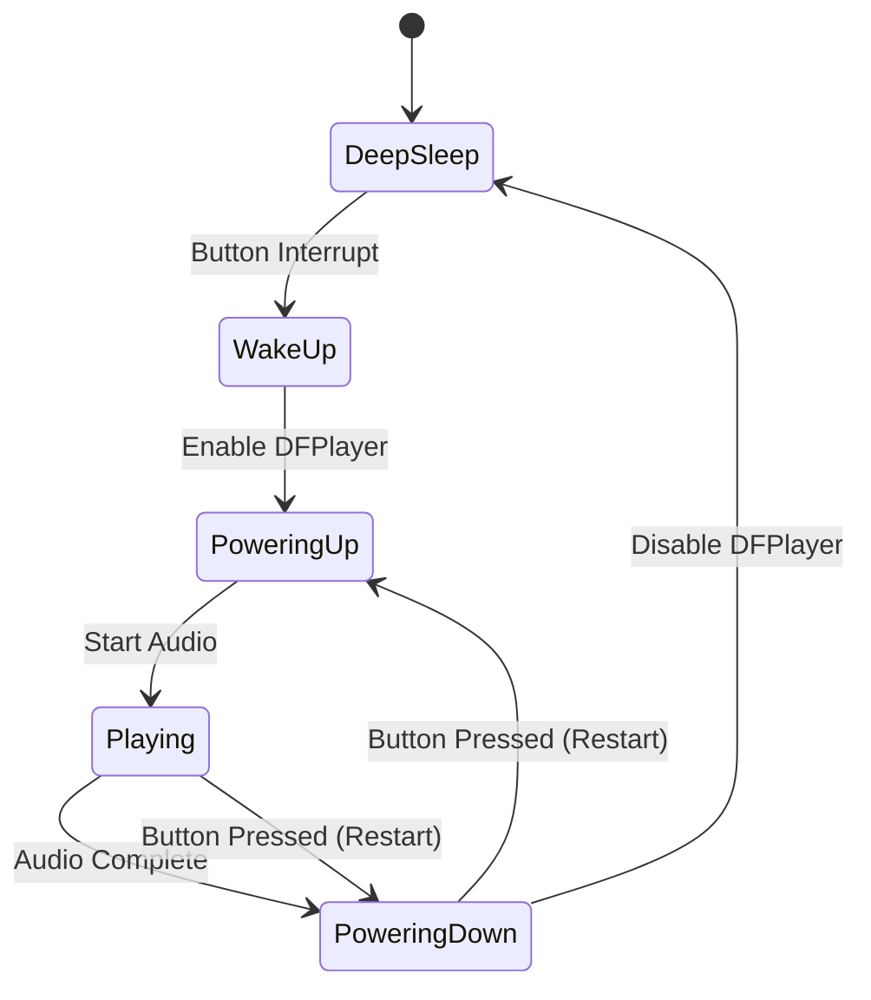
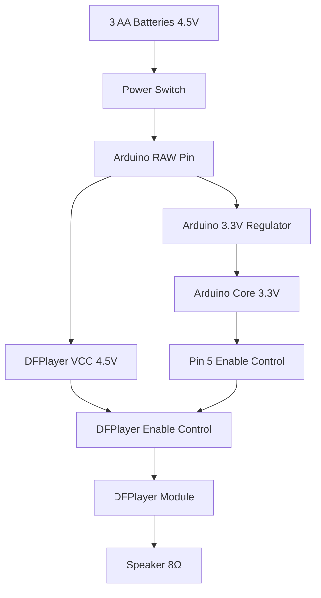

# Design Document - Button-Triggered Audio Enhancement

## Overview

This design transforms the existing continuous-play audio system into a power-efficient, button-triggered device. The system will use deep sleep mode to achieve ultra-low power consumption (≤10µA) when idle, only waking to play audio when the button is pressed. The power system will be upgraded from 2 AA batteries (3V) to 3 AA batteries (4.5V) to provide reliable voltage for the DFPlayer Mini module.

## Architecture

### System State Machine



### Power Management Architecture



## Components and Interfaces

### Hardware Components

**Power System:**
- 3x AA Alkaline Batteries (4.5V total)
- Battery holder with integrated switch
- Power delivered to Arduino RAW pin and DFPlayer VCC in parallel

**Control System:**
- Arduino Pro Mini 3.3V/8MHz (power LED removed)
- Pin 2: Button input with internal pull-up
- Pin 3: TX to DFPlayer RX
- Pin 4: RX from DFPlayer TX  
- Pin 5: DFPlayer enable control

**Audio System:**
- DFPlayer Mini MP3 module
- 8Ω 2W speaker
- MicroSD card with audio files

**Input System:**
- Large momentary button (emergency stop style)
- Connected between Pin 2 and GND

### Software Architecture

**Core Classes:**

```cpp
class PowerManager {
    void enterDeepSleep();
    void wakeFromSleep();
    void enableDFPlayer();
    void disableDFPlayer();
    bool isDFPlayerEnabled();
};

class AudioController {
    bool initialize();
    void playAudio();
    bool isPlaying();
    void stop();
};

class ButtonHandler {
    void setupInterrupt();
    bool isPressed();
    void debounce();
};
```

**Main Program Flow:**

```cpp
void setup() {
    // Initialize components
    // Remove power LED (hardware modification)
    // Setup button interrupt
    // Configure power management
    // Enter initial sleep state
}

void loop() {
    // This should rarely execute due to sleep mode
    if (buttonPressed) {
        handleButtonPress();
    }
    enterDeepSleep();
}

void handleButtonPress() {
    wakeFromSleep();
    enableDFPlayer();
    playAudio();
    waitForAudioComplete();
    disableDFPlayer();
    enterDeepSleep();
}
```

## Data Models

### System State Enumeration

```cpp
enum SystemState {
    DEEP_SLEEP,      // Ultra-low power mode (~10µA)
    WAKING_UP,       // Transitioning from sleep (~20mA)
    POWERING_UP,     // Enabling DFPlayer (~25mA)
    PLAYING,         // Audio playback (~150mA)
    POWERING_DOWN    // Disabling DFPlayer (~25mA)
};
```

### Power Consumption Profile

```cpp
struct PowerProfile {
    SystemState state;
    uint16_t currentMicroAmps;
    uint16_t durationMs;
    float powerMilliWatts;
};
```

### Button State Management

```cpp
struct ButtonState {
    bool currentState;
    bool previousState;
    unsigned long lastDebounceTime;
    unsigned long debounceDelay = 50; // 50ms debounce
    bool stateChanged;
};
```

## Error Handling

### DFPlayer Communication Errors

**Error Detection:**
- Timeout on initialization (3 second limit)
- SD card detection failure
- Audio file not found
- Communication checksum errors

**Error Recovery:**
- Retry initialization with different methods
- Power cycle DFPlayer via enable pin
- Fall back to basic play commands
- Log errors via serial for debugging

**Graceful Degradation:**
- Continue operation even if some features fail
- Provide audio feedback for critical errors
- Maintain low power operation regardless of errors

### Power System Errors

**Low Battery Detection:**
- Monitor voltage via analog pin (optional)
- Detect voltage drops during audio playback
- Provide warning before complete failure

**Power Management Failures:**
- Watchdog timer to recover from hangs
- Automatic sleep mode entry on timeout
- Hardware reset capability

### Button Input Errors

**Debouncing Strategy:**
- Software debouncing with 50ms delay
- State change detection to prevent multiple triggers
- Interrupt-driven input for reliable wake-up

**Mechanical Failure Handling:**
- Timeout protection for stuck buttons
- Multiple press detection and filtering
- Graceful handling of button hardware failures

## Testing Strategy

### Unit Testing

**Power Management Tests:**
```cpp
void testDeepSleepEntry() {
    // Verify current consumption drops to <10µA
    // Test wake-up interrupt functionality
    // Validate DFPlayer enable/disable control
}

void testDFPlayerControl() {
    // Test enable pin control
    // Verify power-up sequence timing
    // Test communication establishment
}
```

**Audio System Tests:**
```cpp
void testAudioPlayback() {
    // Verify file detection and playback
    // Test audio completion detection
    // Validate speaker output levels
}
```

**Button Input Tests:**
```cpp
void testButtonDebouncing() {
    // Simulate button bounce conditions
    // Verify single trigger per press
    // Test interrupt wake-up reliability
}
```

### Integration Testing

**Power Consumption Validation:**
- Measure actual current in each system state
- Verify battery life calculations
- Test under various temperature conditions

**Audio Quality Testing:**
- Verify audio clarity and volume
- Test speaker impedance matching
- Validate frequency response

**Reliability Testing:**
- Continuous operation testing (1000+ button presses)
- Temperature cycling tests
- Vibration and shock testing

### System Testing

**Battery Life Testing:**
- Measure actual vs. calculated battery life
- Test with different battery brands and types
- Validate low-power sleep mode effectiveness

**User Experience Testing:**
- Button response time measurement
- Audio playback consistency
- Overall system reliability

## Implementation Considerations

### Hardware Modifications Required

**Arduino Pro Mini Optimization:**
1. **Remove Power LED** (Critical - saves 8-10mA continuously)
   - Desolder or cut the power LED
   - This is the most important power optimization

2. **Power Connection Strategy:**
   - Connect 4.5V to RAW pin (not VCC)
   - Let Arduino's onboard regulator provide 3.3V
   - Connect DFPlayer VCC to same 4.5V supply

**DFPlayer Power Control:**
- Use Pin 5 to control DFPlayer enable pin
- Completely power down DFPlayer when not in use
- Eliminates 25mA standby current

### Software Optimization Strategies

**Deep Sleep Implementation:**
```cpp
#include <avr/sleep.h>
#include <avr/power.h>

void enterDeepSleep() {
    // Disable unnecessary peripherals
    power_adc_disable();
    power_spi_disable();
    power_twi_disable();
    power_timer1_disable();
    power_timer2_disable();
    
    // Configure sleep mode
    set_sleep_mode(SLEEP_MODE_PWR_DOWN);
    sleep_bod_disable();
    
    // Enable sleep and wait for interrupt
    sleep_enable();
    sleep_cpu();
    
    // Wake up here on button interrupt
    sleep_disable();
    
    // Re-enable peripherals
    power_all_enable();
}
```

**Interrupt-Driven Button Handling:**
```cpp
volatile bool buttonPressed = false;

void setup() {
    pinMode(2, INPUT_PULLUP);
    attachInterrupt(digitalPinToInterrupt(2), buttonISR, FALLING);
}

void buttonISR() {
    buttonPressed = true;
}
```

### Power System Design Details

**Battery Configuration:**
- 3x AA batteries in series = 4.5V nominal
- Provides adequate voltage margin for DFPlayer (requires 4.5-5.5V)
- Arduino RAW pin accepts up to 12V, regulates down to 3.3V

**Current Consumption Budget:**
- Deep Sleep: ~10µA (Arduino + minimal leakage)
- Wake/Setup: ~20mA for 1-2 seconds
- Audio Playback: ~150mA for 2-3 seconds
- Average: ~55µA with typical usage patterns

**Expected Battery Life:**
- Light use (5 presses/day): 12-18 months
- Medium use (20 presses/day): 8-12 months  
- Heavy use (100 presses/day): 3-6 months

### Mechanical Integration

**Enclosure Considerations:**
- Button must be easily accessible and prominent
- Speaker grille for audio output
- Battery compartment access
- SD card slot accessibility for DFPlayer

**Wiring Strategy:**
- Use stranded wire for flexibility
- Implement strain relief at all connection points
- Color-code wires for easy troubleshooting
- Secure all connections with proper soldering

This design provides a robust, power-efficient solution that transforms the existing continuous-play device into a user-controlled, battery-optimized audio trigger system.