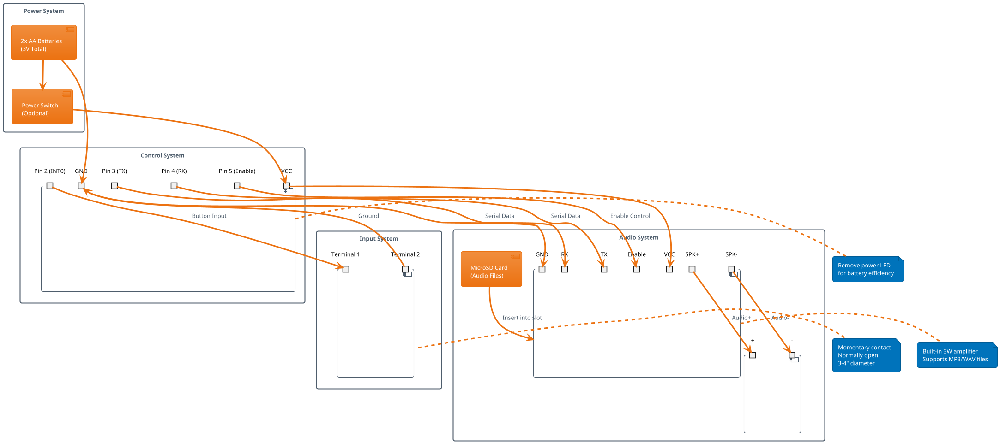
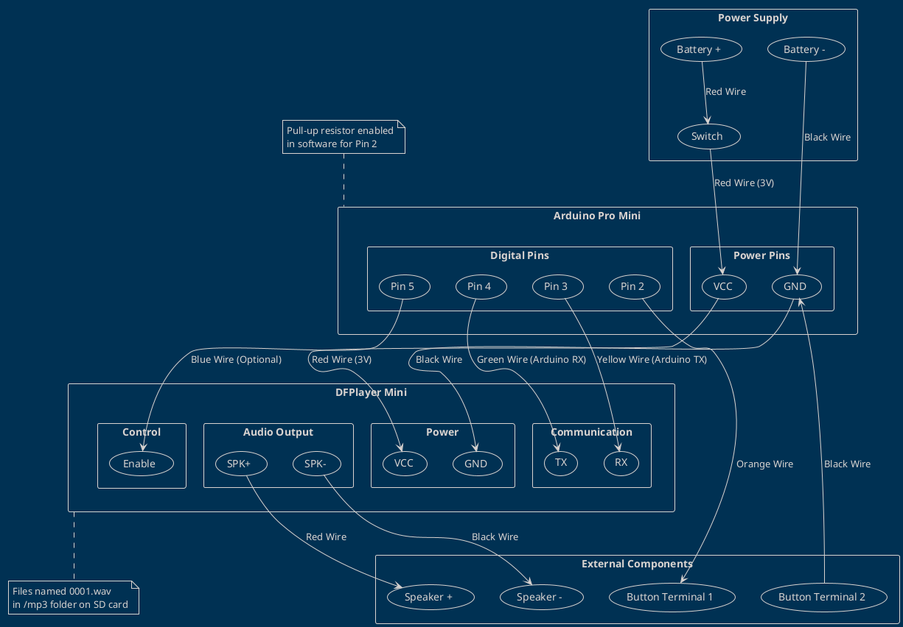
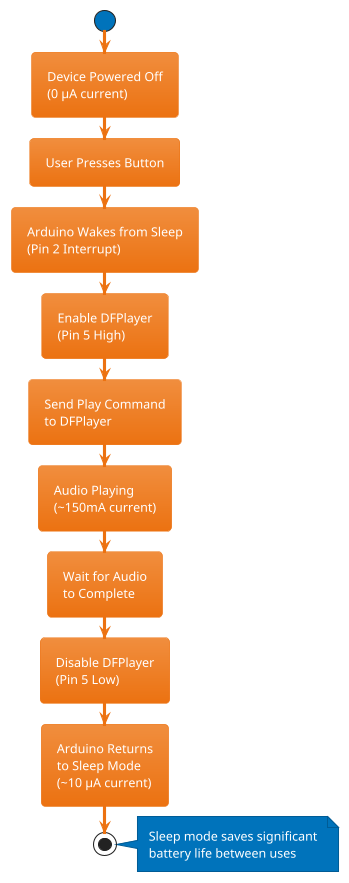
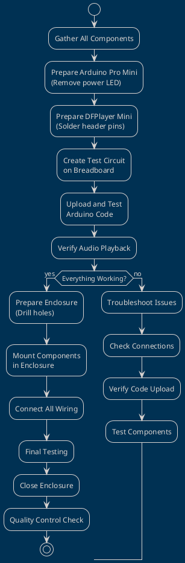
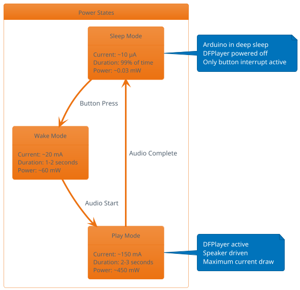
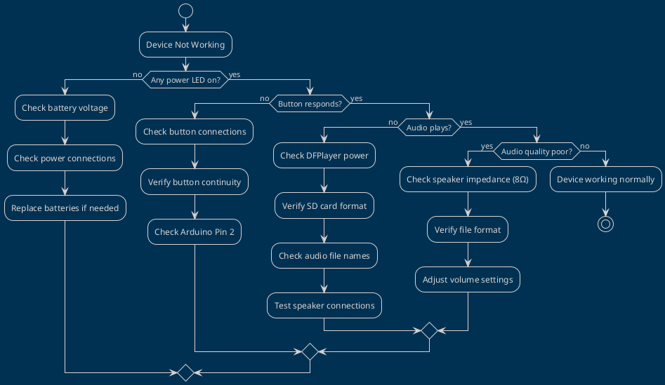

# Circuit Diagrams and Wiring Schematics

This document contains the circuit diagrams and wiring schematics for the "Ah! My Groin!" sound effect device using PlantUML format.

## Main Circuit Diagram



## Detailed Wiring Schematic



## Power Management Diagram



## Component Layout Diagram

```plantuml
@startuml Physical_Layout
!theme plain

rectangle "Enclosure (4\" x 3\" x 1.5\")" {
  
  rectangle "Top Panel" {
    circle "Big Red Button\n(3-4\" diameter)" as button
  }
  
  rectangle "Internal Layout" {
    rectangle "Main PCB Area" {
      component "Arduino\nPro Mini" as arduino
      component "DFPlayer\nMini" as dfplayer
    }
    
    rectangle "Audio Section" {
      component "Speaker\n(2-3\")" as speaker
      component "SD Card\nSlot" as sdcard
    }
    
    rectangle "Power Section" {
      component "Battery\nHolder" as batteries
      component "Power\nSwitch" as switch
    }
  }
  
  rectangle "Side Panel" {
    component "Volume Control\n(Optional)" as volume
    component "Charging Port\n(Optional)" as charging
  }
}

button --> arduino : Button Wires
arduino --> dfplayer : Serial + Power
dfplayer --> speaker : Audio Output
dfplayer --> sdcard : Data Lines
batteries --> arduino : Power
switch --> batteries : Power Control

note right of button
  Mounted through
  top panel for
  easy access
end note

note right of speaker
  Speaker grille
  on front or
  bottom panel
end note

@enduml
```

## Assembly Process Flow



## Power Consumption Analysis



## Troubleshooting Decision Tree



These diagrams provide a comprehensive view of the system architecture, wiring requirements, and assembly process for the sound effect device. 